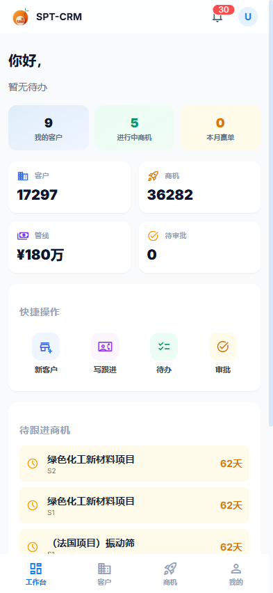
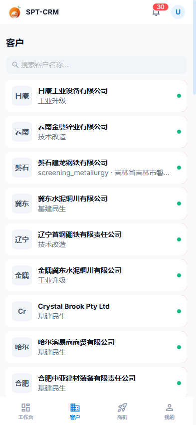
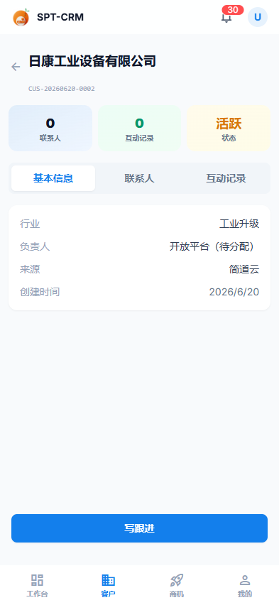
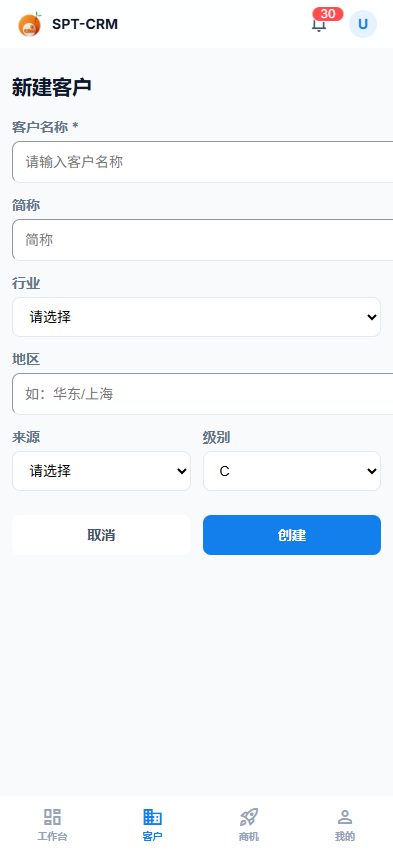
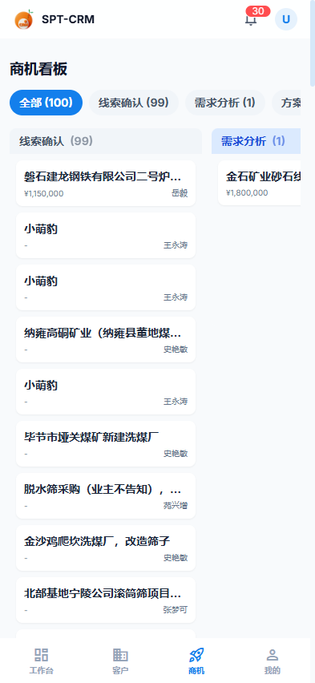
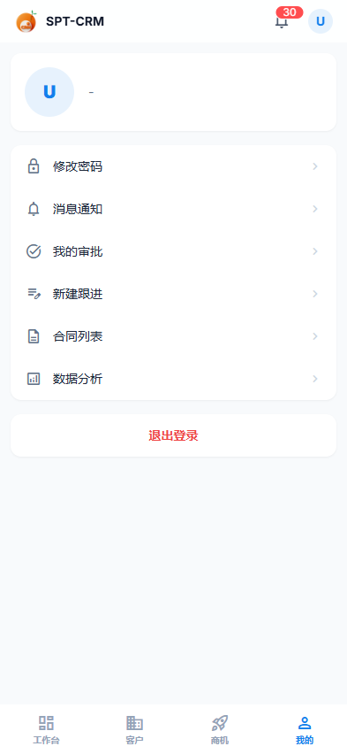

# SPT-CRM 移动端操作说明书

> 适用范围：销售、售后等外勤人员在手机浏览器中使用的 SPT-CRM 移动端。
> 访问地址：**https://link.fourier.net.cn:39019/**（移动端专用域名，手机打开后自动进入移动界面）。
> 文档版本：2026-06-22，基于线上环境实测整理。

---

## 0. 移动端与电脑端的关系

SPT-CRM 三个域名共用同一套系统，按域名自动进入不同界面：

| 域名 | 界面 | 适用设备 |
|------|------|----------|
| `wm.fourier.net.cn` | 电脑（Web）端 | 办公室电脑 |
| **`link.fourier.net.cn`** | **移动端** | **手机** |
| `wm-platform.fourier.net.cn` | 平台管理端 | 管理员 |

移动端账号、数据、权限与电脑端**完全一致**，只是界面针对手机做了精简，突出"看、跟、批"三件事：随时看数据、随手记跟进、随地批审批。

**建议**：用手机浏览器打开 `https://link.fourier.net.cn:39019/` 后，点击浏览器菜单"添加到主屏幕"，即可像 App 一样从桌面图标直接打开。

---

## 1. 登录

1. 手机浏览器打开 `https://link.fourier.net.cn:39019/`。
2. 系统自动跳到登录页（橙色 SPT-CRM 标志）。
3. 两种登录方式：
   - **账号密码**：输入"用户名 / 手机号"+ 密码，点【登 录】。用户名或手机号都可以登录。
   - **钉钉一键登录**：点蓝色【钉钉一键登录】按钮，用钉钉扫码 / 授权（需管理员已开启钉钉登录）。
4. 登录成功后自动进入【工作台】。

> 登录态保存在本机，下次打开免登录；点【我的 → 退出登录】可手动退出。

---

## 2. 工作台（首页）

登录后默认进入工作台，自上而下：

- **顶部**：左侧系统标志，右侧🔔通知铃铛（红色数字为未读数）+ 头像。
- **个人概览**：我的客户数 / 进行中商机数 / 本月赢单数。
- **四个统计卡**：客户总数、商机总数、管线金额（¥）、待审批数。点卡片可跳转对应列表。
- **快捷操作**：新客户、写跟进、待办、审批，一键直达高频动作。
- **待跟进商机**：列出停滞天数较多的商机（如"62天"），点击进入商机详情。
- **待跟进线索 / 未关闭工单**：提醒需要处理的线索数与工单数。

> **下拉刷新**：在工作台顶部下拉，可刷新全部数据。

底部固定 **4 个标签页**：工作台 / 客户 / 商机 / 我的——这是移动端的主导航。

---

## 3. 客户

### 3.1 客户列表

- 点底部【客户】进入。顶部搜索框可按**客户名称**模糊搜索。
- 每行显示：客户简称（头像块）、客户全名、行业/场景标签、右侧绿点为状态。
- **左滑某一行**可呼出【拨号】【删除】快捷操作（删除请谨慎）。
- 点击客户行进入**客户详情**。

### 3.2 客户详情

- 顶部：客户名称 + 客户编号（如 CUS-20260620-0002）。
- 三个统计：联系人数、互动记录数、客户状态（活跃/...）。
- 三个标签页：**基本信息**（行业、负责人、来源、创建时间）、**联系人**、**互动记录**。
- 底部【写跟进】按钮：直接为该客户新增一条跟进记录。

### 3.3 新建客户

1. 工作台点【新客户】，或客户列表右上角进入。
2. 填写：客户名称（必填，带*）、简称、行业、地区、来源、级别。
3. 点【创建】保存，点【取消】放弃。

---

## 4. 商机

### 4.1 商机看板

- 点底部【商机】进入"商机看板"。
- 顶部为**阶段筛选标签**：全部 / 线索确认 / 需求分析 / 方案报价 / 商务谈判 / 合同签订 / 交付验收，括号内为各阶段数量。
- 下方按阶段分列展示商机卡片，每张卡显示：商机名称、预期金额（¥）、负责人。**左右横滑**可查看不同阶段列。
- 点击卡片进入**商机详情**。

### 4.2 商机详情

- 顶部：商机名称、编号、当前阶段标签。
- 三个 KPI 卡：预期金额、赢率、风险等级。
- 标签页：**基本信息**（状态、客户、负责人、预计关单、创建时间、竞争对手、需求摘要）/ **互动记录**。
- 底部：【风险评估】【写跟进】。
- **手势**：在详情页**右滑**可返回上一页。

---

## 5. 审批

- 入口：工作台【审批】、或【我的 → 我的审批】。
- **审批中心**列出待我审批 / 我发起的流程。
- 点击进入**审批详情**，可查看关键信息（报价金额、毛利率、合同编号、AI 风险提示等），并执行【通过】/【拒绝】/【转交】。
- 详情页**右滑返回**。

---

## 6. 跟进 / 待办 / 通知 / 日程

| 功能 | 入口 | 说明 |
|------|------|------|
| **写跟进** | 工作台【写跟进】、客户/商机详情底部 | 选择互动类型（电话/拜访/会议…）、填写小结与结果，提交后计入互动记录 |
| **待办任务** | 工作台【待办】 | 查看分配给我的任务；右上【+】新建；无任务时显示"暂无待办任务" |
| **通知** | 顶部🔔 或【我的 → 消息通知】 | 系统通知、审批提醒、回款提醒等 |
| **日程** | 直接访问 / 相关入口 | 个人日程安排 |

---

## 7. 我的

底部【我的】，包含：
- 顶部：头像 + 用户名。
- **修改密码**、**消息通知**、**我的审批**、**新建跟进**、**合同列表**、**数据分析**。
- 底部红色【退出登录】。

---

## 8. 常见问题

| 现象 | 处理 |
|------|------|
| 打开是电脑版界面 | 确认用的是 `link.fourier.net.cn:39019` 域名；该域名手机访问会自动进移动端 |
| 提示"用户名或密码错误" | 用户名/手机号或密码有误，请使用本人账号（用户名或手机号均可）登录 |
| 文件下载/附件打不开 | 检查网络；附件功能依赖对象存储配置 |
| 页面数据不是最新 | 工作台下拉刷新，或重新进入页面 |
| 顶部出现"离线模式"黄条 | 当前网络断开，部分数据为缓存，恢复网络后会自动更新 |

---

## 附：移动端功能清单（实测可用）

工作台 · 客户（列表/详情/新建/搜索/拨号）· 联系人 · 互动记录 · 商机（看板/详情/新建/风险评估）· 报价详情 · 线索（列表/详情/新建）· 审批（中心/详情/通过/拒绝/转交）· 跟进 · 待办 · 通知 · 日程 · 合同 · 回款 · 售后工单 · 产品目录 · 报表 · 全局搜索 · 个人中心。
