# 振动筛制造行业 · SPT-CRM 全流程操作手册

> 适用对象：离散制造业（机械装备）销售、技术、商务、售后人员
> 行业样例：振动筛 / 筛分分选成套设备制造商
> 演示环境：生产系统 `https://wm.fourier.net.cn:8410`（登录用户 `hengchao`）
> 演示客户：**山东金石矿业有限公司**（砂石骨料二期生产线圆振动筛采购项目）
> 编写日期：2026-06-01

---

## 一、为什么离散制造适合这套流程

振动筛这类**按单设计/选型制造**（ETO / CTO）的离散制造业，订单具有以下特征，CRM 的"线索 → 商机 → 方案选型 → 报价 → 合同 → 交付 → 售后"主线正是为此设计：

| 行业特征 | 对应 CRM 能力 |
| --- | --- |
| 设备需按工况选型（处理量、筛面、层数、电机功率） | **方案模块** 的"配置/选型清单"结构化表格 + 版本管理 |
| 交付周期长、对基础/供货有依赖，风险需提前识别 | **方案模块** 的"风险清单"（高/中/低分级 + 缓解措施） |
| 报价含多台设备、备件、服务，需多版本与审批 | **报价模块** 行项目 + 版本快照 + 提交审批 |
| 合同金额大、分期回款 | **合同/回款模块**，可由报价一键生成合同 |
| 交付包含设计、生产、发货、安装调试、验收节点 | **交付里程碑** |
| 设备投运后有质保、检修、备件需求 | **售后工单**（SLA 分级） |

下面以"山东金石矿业砂石线圆振动筛采购项目"为例，演示完整闭环。

---

## 二、登录系统

浏览器打开 `https://wm.fourier.net.cn:8410`，使用账号密码登录（或"钉钉一键登录"）。登录后进入**工作台**，可总览客户/线索/商机/管线金额、风险预警、销售漏斗、回款与审批 SLA 等关键指标。

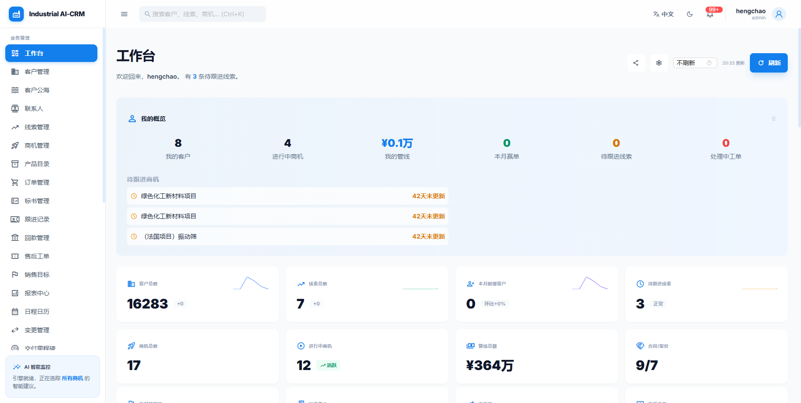

---

## 三、第 1 步：录入销售线索

**菜单：左侧「线索管理」→「新建线索」**

展会、官网、转介绍等渠道获取的询盘，先登记为线索。填写要点（振动筛行业）：

- **线索标题**：用"客户简称 + 项目 + 设备类型"，如"金石矿业砂石生产线圆振动筛采购询盘"。
- **公司名称**（必填）：转化为客户时将作为客户名称。
- **行业**：选择"筛分分选-砂石/矿山/冶金/煤炭…"等细分行业，便于后续分析。
- **线索来源**：展会 / 官网 / 转介绍等。
- **需求摘要**：写清**工况关键参数**——处理量(t/h)、物料粒度、含水率、台数、交付预期，这些是后续选型依据。

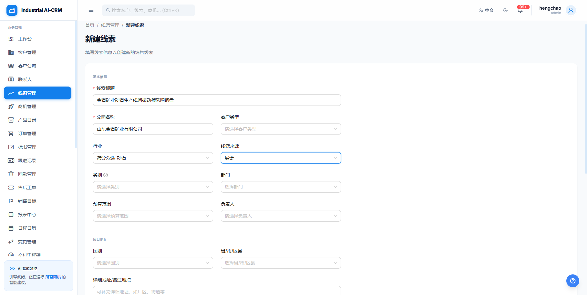

保存后回到线索列表。系统自动生成线索编号（如 `LD-20260601-0001`）并给出 **AI 线索评分**（本例 85 分，优质）。

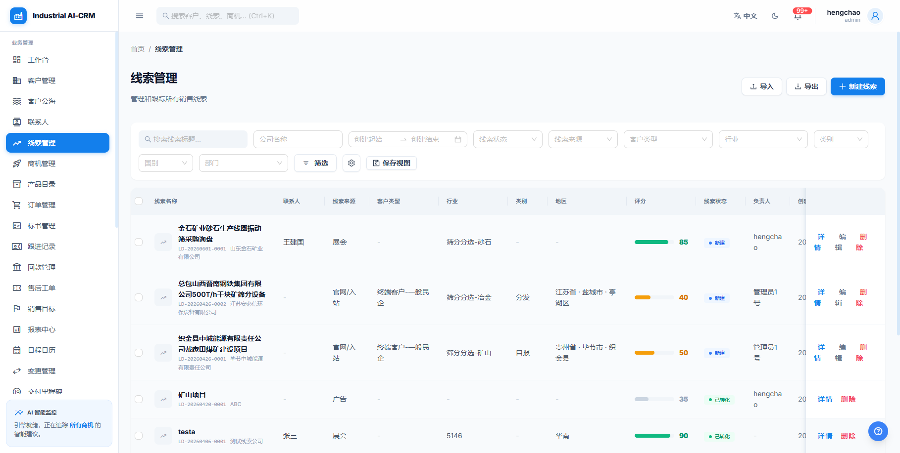

---

## 四、第 2 步：线索转化为客户

打开线索详情，可见 **AI 线索评分**与**智能洞察**（评分分析、建议操作）。确认有效后点击右上角 **「转化为客户」**，确认弹窗后线索状态变为"已转化"，并自动建档客户。

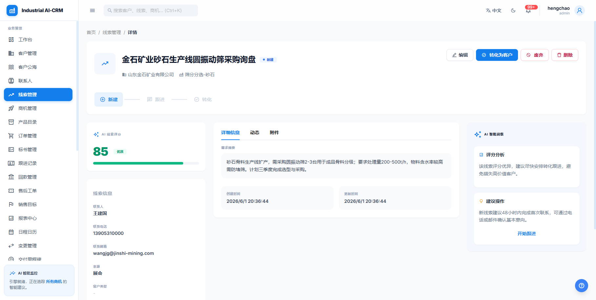

转化后进入**客户详情**，公司信息、联系人随之带入。客户是后续商机、报价、合同、工单的归属主体。

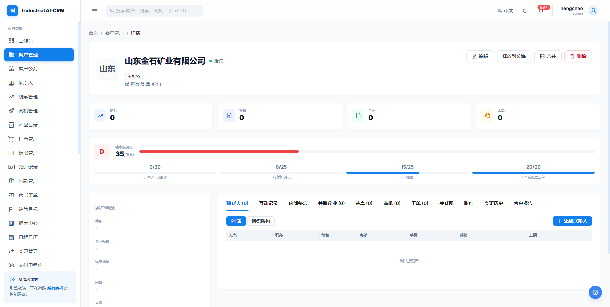

---

## 五、第 3 步：创建商机并推进阶段

**菜单：左侧「商机管理」→「新建商机」**，关联刚建的客户。填写要点：

- **项目名称、关联客户**（必填）、**预期金额**（本例 ¥1,800,000）
- **成交概率**（40%）、**预期成交日期**（2026-09-30）
- 离散制造特有开关：**是否有保函 / 是否有重量要求 / 是否使用呆滞设备**——影响成本与风险评估。

保存后进入**商机详情**：顶部是 **S1→S6 阶段进度条**，左侧"项目画像"+"健康度"评分（活跃度、阶段覆盖、报价版本、回款风险、交期可信度等多维度打分），下方为方案/报价/合同/交付/回款/变更等业务标签页。

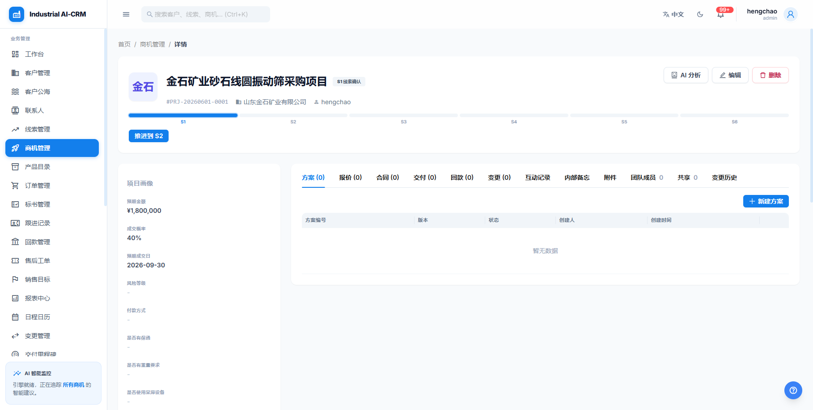

点击 **「推进到 S2」**，在弹窗中填写变更说明（如"已确认砂石线产能与筛分需求，进入需求分析"）即可推进阶段。每次推进都会校验该阶段的"门禁规则"并记录阶段历史。

> 阶段含义（默认）：S1 线索确认 → S2 需求分析 → S3 方案/报价 → S4 商务谈判 → S5 签约 → S6 交付。

---

## 六、第 4 步：方案选型清单 + 风险清单（核心）

在商机详情「方案」标签页点击 **「新建方案」**，系统创建方案及其 V1 版本，点击进入**方案详情**，再点 **「编辑」**。这是振动筛选型最关键的一步。

> 说明：本页"配置/选型清单"与"风险清单"采用**结构化编辑器**（表格 / 卡片），无需手写 JSON。

### 6.1 配置/选型清单（可编辑表格）

- 默认列为"名称/规格型号/数量/备注"，**列名可直接修改**，点表头右侧 **+** 增列、垃圾桶图标删列。
- 点 **「添加行」** 增加设备行；每行逐格填写。
- 振动筛选型建议列：**设备名称 / 型号·筛面规格 / 处理能力(t/h) / 数量(台)**（可再加"电机功率""层数""筛孔"等）。

### 6.2 风险清单（结构化卡片）

- 点 **「添加风险」** 新增风险项，每项含**严重程度（高/中/低下拉）、风险描述、缓解措施**。
- 振动筛常见风险：物料含水率高致筛孔堵塞、电机/激振器供货周期、基础动载荷复核等。

编辑态如下（左为选型表格，右为风险卡片，严重程度用下拉选择）：

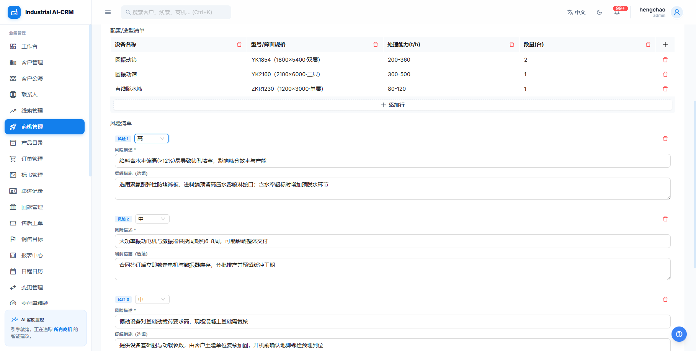

点 **「保存」** 后进入只读视图：选型清单渲染为整洁表格，风险清单渲染为带等级标识（H 红 / M 橙 / L 绿）的卡片。可"创建新版本"做多轮选型迭代，并支持版本对比。

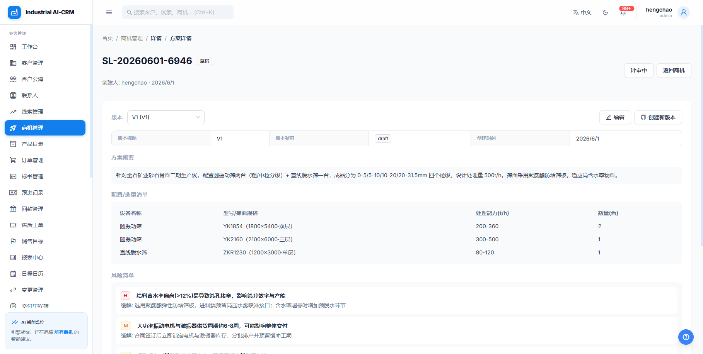

---

## 七、第 5 步：报价（多台设备行项目）

在商机详情「报价」标签页点击 **「新建报价」**，进入**报价详情**，点 **「添加行」** 逐条录入设备行项目。每行字段：

- **类型**（标准品 / 非标品 / 服务 / 备件）、**品名、编码、规格**
- **数量、单位、单价、估计成本、交期(天)**——系统自动算"行合计""毛利率"。

本例录入 3 行（与方案选型一致）：

| 类型 | 品名 | 规格 | 数量 | 单价(元) |
| --- | --- | --- | --- | --- |
| 标准品 | 圆振动筛 YK1854 | 1800×5400·双层·200-360t/h·22kW | 2 | 280,000 |
| 标准品 | 圆振动筛 YK2160 | 2100×6000·三层·300-500t/h·30kW | 1 | 360,000 |
| 标准品 | 直线脱水筛 ZKR1230 | 1200×3000·单层·80-120t/h·2×4kW | 1 | 120,000 |

报价支持**保存快照、创建新版本、发送报价、提交审批、导出 PDF、打印**。

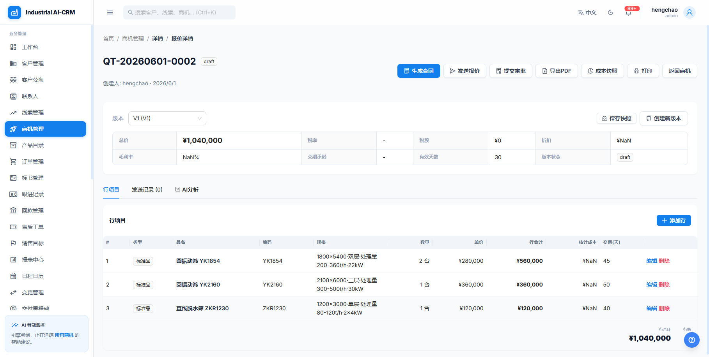

---

## 八、第 6 步：由报价生成合同

在报价详情点击 **「生成合同」**，确认后系统按报价金额与条款自动生成合同，并跳转**合同详情**。合同支持版本、签署、回款计划等管理。

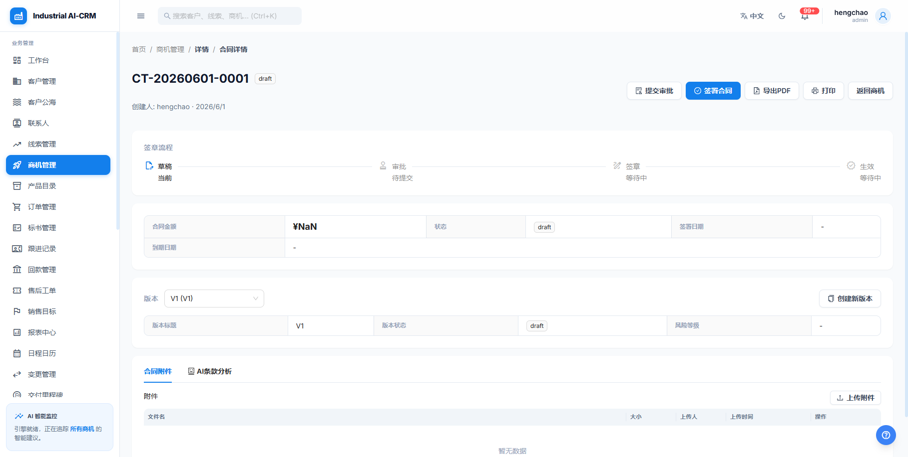

---

## 九、第 7 步：交付里程碑

在商机详情「交付」标签页点击 **「新建里程碑」**，按设备交付节点登记：

- **节点编码**（design / production / delivery / acceptance）、**名称、计划日期、状态、负责人**。

本例交付计划（振动筛典型节点）：

| 节点 | 名称 | 计划日期 |
| --- | --- | --- |
| design | 技术设计与选型确认 | 2026-07-15 |
| production | 整机生产与装配 | 2026-08-20 |
| delivery | 发货运输 | 2026-09-05 |
| acceptance | 现场安装调试与验收 | 2026-09-25 |

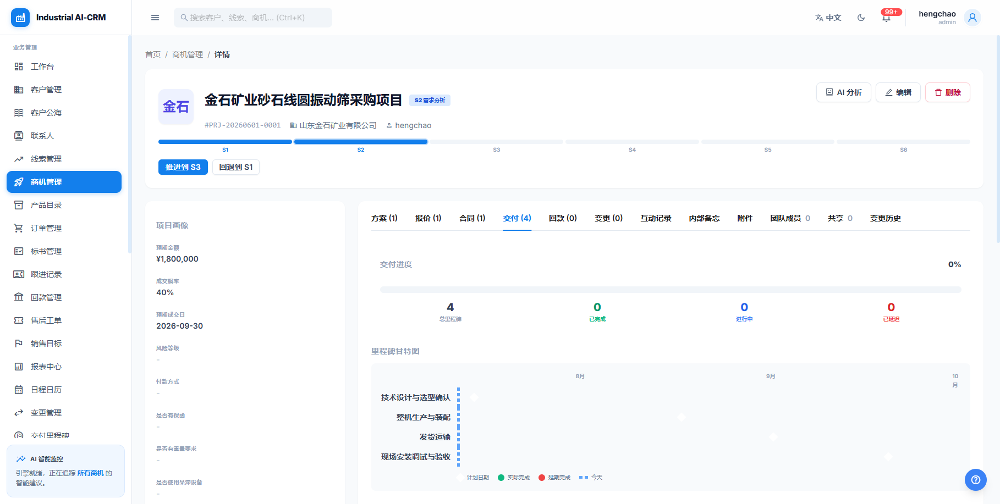

> 里程碑也可与 ERP 订单做映射（「新建映射」），实现生产/发货状态与 ERP 同步。

---

## 十、第 8 步：售后工单

设备投运后的故障、维保、培训、备件需求，在 **菜单「售后工单」→「新建工单」** 登记：

- **关联客户、类型（故障/维保/培训等）、优先级（紧急/高/中/低）、描述**。
- 系统按优先级套用 **SLA 响应时限**（紧急 4h / 高 8h / 中 24h / 低 72h）并统计达标率。

本例：金石矿业 1# 圆振动筛投运两周后异响，登记为**高优先级故障工单**。

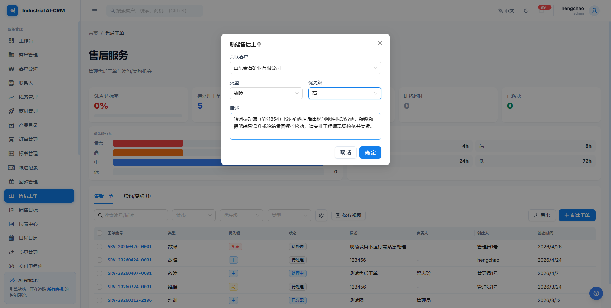

提交后进入工单列表，可按状态/优先级/类型筛选、跟踪处理进度与续约/复购机会。

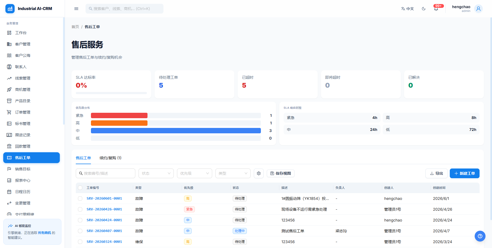

---

## 十一、流程总览

```
线索(LD)  ──转化──▶  客户(CUS)
                         │
                         ▼
                     商机(PRJ) ──S1→S2→…→S6 阶段推进
                         │
        ┌────────────────┼─────────────────┬───────────────┐
        ▼                ▼                 ▼               ▼
   方案(SL)          报价(QT)           合同            交付里程碑
 选型清单+风险      多设备行项目      由报价生成        设计/生产/发货/验收
        │                │
        └──── 版本迭代/对比 ────┘
                                          投运后 ▶ 售后工单(SRV, SLA)
```

---

## 十二、本次演示生成的数据（便于复核 / 清理）

| 对象 | 编号 / 名称 | 备注 |
| --- | --- | --- |
| 线索 | `LD-20260601-0001` 金石矿业砂石生产线圆振动筛采购询盘 | 已转化 |
| 客户 | 山东金石矿业有限公司 | 由线索转化生成 |
| 商机 | `PRJ-20260601-0001` 金石矿业砂石线圆振动筛采购项目 | 阶段已推进至 S2，¥180万 |
| 方案 | `SL-20260601-6946` V1 | 含 3 行选型清单 + 3 条风险 |
| 报价 | `QT-20260601-0002` V1 | 3 行项目，合计约 ¥104万 |
| 合同 | 由报价 QT-20260601-0002 生成 | — |
| 交付里程碑 | design / production / delivery / acceptance | 4 个节点 |
| 售后工单 | 金石矿业 1# 圆振动筛异响（高/故障） | — |

> ⚠️ 以上为**生产环境演示数据**。如需清理，可按客户"山东金石矿业有限公司"为线索，依次删除其售后工单、交付里程碑、合同、报价、方案、商机、客户、线索。

---

*本手册由实际操作生产系统截图生成，界面以系统实际显示为准。*
